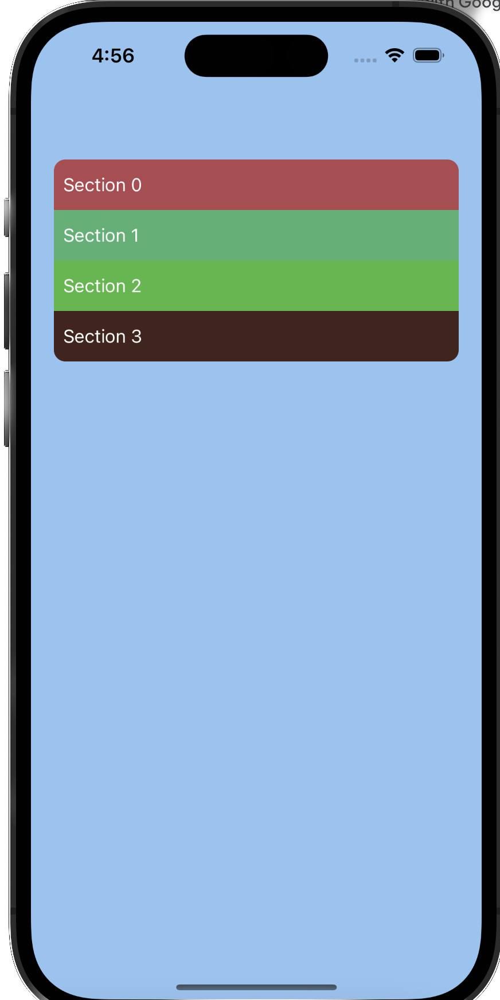
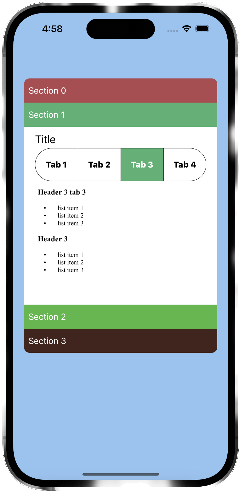

# Collapsible-Table-using-UITableViewController-in-ios
Collapsible Table using UITableViewController in ios that does not take up whole page

  

To use this code in your project, just copy the files in the folder "CustomeView" and "Extenstion" to your project.


Then, in your View Controller, create an instance of ServiceCollapsibleTableViewController and add it as a subview of your view controller's view. Then, set the constraints of the table view to be within the bounds of your view controller's view. Finally, call the attachHeightConstraint method of the table view controller and pass in the height constraint of the table view.

The table view controller will automatically update the height constraint of the table view to be the height of the table view. This will allow the table view to expand and collapse as the user taps on the header cells.

``` swift
import UIKit

class ViewController: UIViewController {
    

    override func viewDidLoad() {
        super.viewDidLoad()
        var table = ServiceCollapsibleTableViewController(sections: sectionsData, estimatedHeight: 500)
        self.view.addSubview(table.view)
        table.view.topAnchor.constraint(equalTo: self.view.topAnchor, constant: 120).isActive = true
        table.view.bottomAnchor.constraint(lessThanOrEqualTo: self.view.bottomAnchor, constant: -10).isActive = true
        table.view.leadingAnchor.constraint(equalTo: self.view.leadingAnchor, constant: 20).isActive = true
        table.view.trailingAnchor.constraint(equalTo: self.view.trailingAnchor, constant: -20).isActive = true
        //calculate height of table after constraints are set
        let height = table.view.systemLayoutSizeFitting(UIView.layoutFittingCompressedSize).height
        let heightConstraint = table.view.heightAnchor.constraint(equalToConstant: CGFloat(44 * sectionsData.count))
        heightConstraint.isActive = true
        table.attachHeightConstraint(heightConstraint)
        table.view.translatesAutoresizingMaskIntoConstraints = false
        table.view.backgroundColor = .white
        table.view.layer.cornerRadius = 10
    }


}
```

# Data Structures
## TabItem
Represents an individual tab item, with a title and a detail.

### Properties:

tabTitle - A String representing the title of the tab item.
detail - A String representing the detail of the tab item.

### Methods:

init(tabTitle: String, detail: String) - Initializes a new TabItem object with the given tabTitle and detail.

## TableItem
Represents a table row, with a title and an array of TabItem objects.

### Properties:

title - A String representing the title of the table row.
tabItems - An array of TabItem objects representing the individual tabs of the table row.
### Methods:

init(title: String, tabItems: [TabItem]) - Initializes a new TableItem object with the given title and tabItems.
## Section
Represents a section of a table, with a name, an array of TableItem objects, a Boolean value indicating whether the section is collapsed, a header background color, and an optional estimated height.

### Properties:

name - A String representing the name of the section.
items - An array of TableItem objects representing the individual rows of the section.
collapsed - A Bool indicating whether the section is collapsed.
headerBackgroundColor - A UIColor representing the background color of the section header.
estimatedHeight - An optional CGFloat representing the estimated height of the section.
## Methods:

init(name: String, items: [TableItem], headerBackgroundColor: UIColor, collapsed: Bool = false, estimatedHeight: CGFloat? = nil) - Initializes a new Section object with the given name, items, headerBackgroundColor, collapsed, and estimatedHeight.
## Example Data
```swift
let section1 = Section(name: "Section 1", items: [
    TableItem(title: "Row 1", tabItems: [
        TabItem(tabTitle: "Tab 1", detail: "Detail 1"),
        TabItem(tabTitle: "Tab 2", detail: "Detail 2"),
        TabItem(tabTitle: "Tab 3", detail: "Detail 3")
    ]),
    TableItem(title: "Row 2", tabItems: [
        TabItem(tabTitle: "Tab 1", detail: "Detail 1"),
        TabItem(tabTitle: "Tab 2", detail: "Detail 2"),
        TabItem(tabTitle: "Tab 3", detail: "Detail 3")
    ]),
    TableItem(title: "Row 3", tabItems: [
        TabItem(tabTitle: "Tab 1", detail: "Detail 1"),
        TabItem(tabTitle: "Tab 2", detail: "Detail 2"),
        TabItem(tabTitle: "Tab 3", detail: "Detail 3")
    ])
], headerBackgroundColor: UIColor(red: 0.0, green: 0.0, blue: 0.0, alpha: 0.1), collapsed: true, estimatedHeight: 100.0)